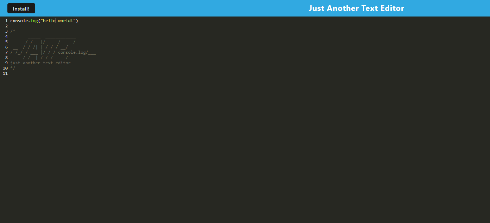

# PWA2

# Progressive Web Applications Text Editor 

# Description 
A single-page application text editor that runs in the browser with offline functionality. 

# Table of Contents

- [Description](#description)
- [Languages](#languages)
- [License](#license)
- [Questions](#questions)
- [Screenshot](#screenshot)

# Languages
- JavaScript
- Node.js
- Express.js
- Idb
- Wepback dependencies
- Workbox

# License
Licensed under the MIT license. Copyright @ MIT. All rights reserved.

# Questions

Github: [erikaylopez](https://github.com/erikaylopez)

Email: [eylopez8686@gmail.com](mailto:eylopez8686@gmail.com)

# Screenshot 

https://pwa2-3.onrender.com/
[Link to Render](https://pwa2-3.onrender.com/)

